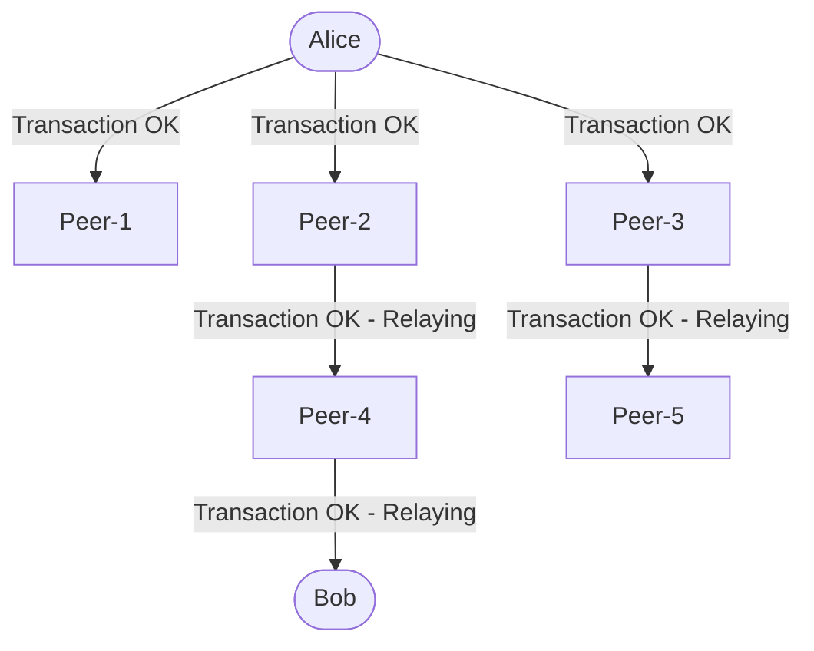

# What is Bitcoin

A system that maintains the transaction of the digital currency *bitcoin*.

## Step 1: Transaction

Some person creates a transaction by providing the following information:
- Address of the reciever(some hash string)
- Amount of BTC to transfer
- Digital signature of the sender using the sender's private key

## Step 2: The Bitcoin Network

This transaction information is sent to all the peers of the sender which is then again sent to their peers. The peers check if the transaction is valid(if the sender *has enough funds to make the transacition* and if the *digital signature is valid*). If the checks pass, the nodes pass on the transaction(**relaying**).

- The transaction information is finally sent to the reciever. 
- All the nodes update their local copies of historic transaction information.

## Step 3: The Blockchain

Multiple transactions happen at the same time and it's difficult to keep track of the order of transactions. To resolve this, one node takes the lead and generates a *block* which contains the information of transactions in a specific order. This block is added to the blockchain and all the nodes in the network according to the message in the block and pass on the block their peers.

To become the leader node, the nodes need to solve a hard problem. The person who solves it gets a reward of some newly minted bitcoins and the transaction fees. 
> *NTS: Is this Proof of Work?*

## Step 4: Wallet

A wallet is a program which connects a node with the bitcoin network.  It manages the user's transactions and keeps track of the balance in the account. Along with this, the wallet maintains their private keys which is used for:
- wallet address generation
- digital signature generation

After a transaction is confirmed, Alice recieves a message from the network saying that her bitcoin has been irreversably sent to Bob. Bob also recieves a message from the network saying that he has recieved a bitcoin irreversably.

When Bob wants to make a transaction again, he will have to generate a digital signature with his private key.

*The bitcoin blockchain has a limit of 12MB of transactions per hour. Miners/lead nodes have to prioritise the transaction, which can be controlled by the transaction fee you are paying for the transaction*

To curb the problem of tiny payments in blockchain, lightning networks are built to make micropayments with a minimal transaction fey(1 satoshi) instantaneously. 1 satoshi = 0.00000001 BTC

