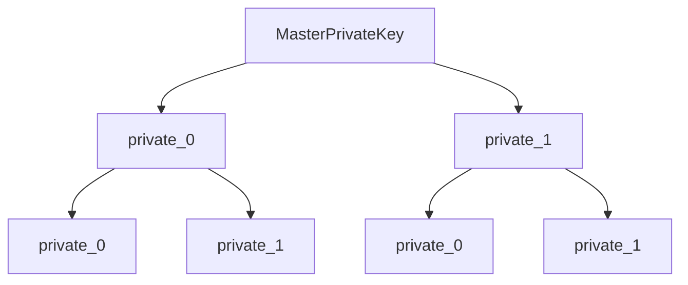

## What are wallets used for?

- automate payments
- store public and private keys
- generate new addresses

**The wallet does not keep the actual money, but the information required to make a transaction i.e the private keys**

How transactions are performed using a wallet:

- The sender scans a QR code which gives the sender's wallet the information necessary to make a transaction, which are the receiver's address and the amount to be paid
- The wallet maintains multiple private keys with the total funds distributed among them(good for privacy). The wallet chooses a private key with enough funds to make the transaction possible.
- The sender's wallet then generates a new address and a digitally signed message to the bitcoin network along with the sender and receiver's address. The network verifies the transaction and the receiver gets the money.

*The transaction is not confirmed until the receiver gets the verification from the network(it can get corrupted).*

## Private key backup

The private keys are the most information for a wallet, so it is a good idea to back it up. One simple way to do this is to store every key in a text file and email it to yourself.

- But this creates a problem with privacy/theft as anyone with access to the email server can see the keys.
- Moreover, every address requires a new key, so everytime a new address is made, the backup needs to updated i.e after every transaction a new key has to be made and backed up. This can become tiresome.

**How to solve it**:

1. automate the creation of backups everytime a new address is created. But this can cause more theft because of the frequency of backups.
2. create 100 addresses and back them up. Re-create more when the 100 has been used. This can also cause theft
3. encrypt the text file we are backing up. This makes it secure.

For optimal performance, a mixture of 2 and 3 needs to be used(less number of backups and encrypted data which protects it from theft)

But this creates more problem because now we also have to remember the password for the encrypted file. This brings us to the Hierarchical Deterministic Wallet which needs only as single seed.

## Hierarchical Deterministic Wallet

The keys are stored as trees. With each key being derived from the root node(master private key)

Each key/node has a unique address. The `private_0` leaf at the left will have the address m/0/0 and the one to it's right will have m/0/1 which are all going to be unique.

The master private key is created from the seed and every private key generated from this master private key is the *extended private key*.

The leaf private keys are used for public key derivation and to perform the transactions.

Along with the keys, the extended private key contains the chain code which is information on how to derive child keys.

